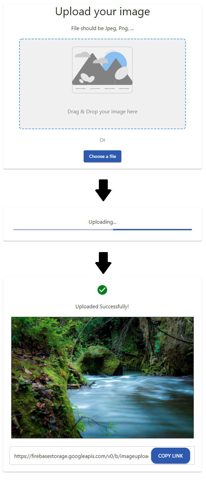

<!-- Please update value in the {}  -->

<h1 align="center">ImageUploader_devchallenges</h1>

<div align="center">
   Solution for a challenge from  <a href="http://devchallenges.io" target="_blank">Devchallenges.io</a>.
</div>

<div align="center">
  <h3>
    <a href="https://imageuploader-devchallenges.web.app">
      Demo
    </a>
    <span> | </span>
    <a href="https://devchallenges.io/solutions/n90xDYwzgA05C1DnmJDn">
      Solution
    </a>
    <span> | </span>
    <a href="https://devchallenges.io/challenges/O2iGT9yBd6xZBrOcVirx">
      Challenge
    </a>
  </h3>
</div>

<!-- TABLE OF CONTENTS -->

## Table of Contents

- [Overview](#overview)
  - [Built With](#built-with)
- [Features](#features)
- [How to use](#how-to-use)
- [License](#License)
- [Contact](#contact)

<!-- OVERVIEW -->

## Overview

Application's screenshot



You can see demo to access <https://imageuploader-devchallenges.web.app>.
For more information, see [this article](https://qiita.com/charon1212/items/314706b141856e5892bb) (written in Japanese).

### Built With

<!-- This section should list any major frameworks that you built your project using. Here are a few examples.-->

- [React](https://reactjs.org/)
- [TypeScript](https://www.typescriptlang.org)
- [Firebase](https://firebase.google.com)

## Features

<!-- List the features of your application or follow the template. Don't share the figma file here :) -->

This application/site was created as a submission to a [DevChallenges](https://devchallenges.io/challenges) challenge. The [challenge](https://devchallenges.io/challenges/O2iGT9yBd6xZBrOcVirx) was to build an application to complete the given user stories.

## How To Use

### run app

To clone and run this application, you'll need [Git](https://git-scm.com) and [Node.js](https://nodejs.org/en/download/) (which comes with [npm](http://npmjs.com)) installed on your computer. From your command line:

```bash
# Clone this repository
$ git clone https://github.com/charon1212/ImageUploader_devchallenges.git

# Install dependencies
$ npm install

# Run the app
$ npm run start
```

### connect backend

In order to connect backend, you should ...

1. make firebase project.
1. make .env file in your project root directory.  
[/src/app/firebase/firebase.ts](https://github.com/charon1212/ImageUploader_devchallenges/blob/main/src/app/firebase/firebase.ts) include firebase settings.  
(See .env.example and <https://firebase.google.com/docs/web/setup#add-sdks-initialize>)
1. set firebase storage's security rule like below:

```javascript
rules_version = '2';
service firebase.storage {
  match /b/{bucket}/o {
    match /images/testFile.jpg {
      allow read, write: if true;
    }
  }
}
```

### execute react unit test

After clone and npm install, execute command:

```bash
$ npm run test
```

### execute selenium e2e test

In order to execute e2e test, you should ...

1. download and setup selenium-webdriver.  
(See "Installation" of <https://www.selenium.dev/selenium/docs/api/javascript/index.html>)
1. execute command below:

```bash
$ npm run jesttest
```

## Contact

- Mail <charon1212.teq@gmail.com>
- GitHub [@charon1212](https://github.com/charon1212)
- Twitter [@charon91179134](https://twitter.com/charon91179134)
